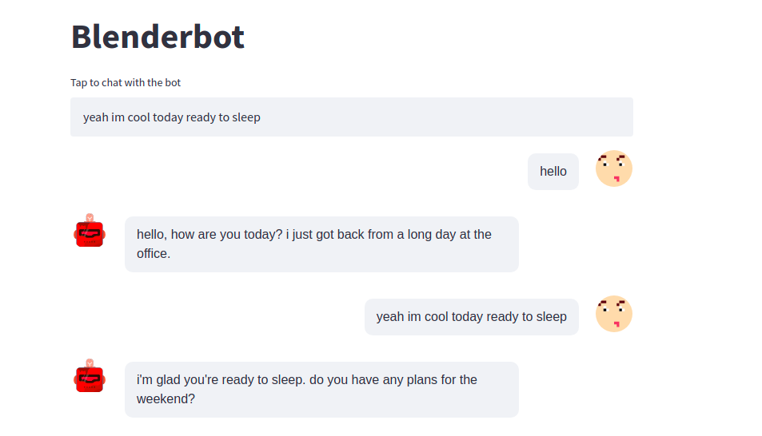

# BlenderBot


### Abstract
Building open-domain chatbots is a challenging area for machine learning research. While prior work has shown that scaling neural models in the number of parameters and the size of the data they are trained on gives improved results, we show that other ingredients are important for a high-performing chatbot. Good conversation requires a number of skills that an expert conversationalist blends in a seamless way: providing engaging talking points and listening to their partners, both asking and answering questions, and displaying knowledge, empathy and personality appropriately, depending on the situation. We show that large scale models can learn these skills when given appropriate training data and choice of generation strategy. We build variants of these recipes with 90M, 2.7B and 9.4B parameter neural models, and make our models and code publicly available. Human evaluations show our best models are superior to existing approaches in multi-turn dialogue in terms of engagingness and humanness measurements. We then discuss the limitations of this work by analyzing failure cases of our models


### Paper : [Recipes for building an open-domain chatbot](https://arxiv.org/pdf/2004.13637.pdf)


## Objectives 
In this repository we use blenderbot via the huggingface library with streamlit-chat to allow interaction between a user and the chatbot.

## Project setup

install the dependencies for this project by running the following commands in your terminal:
```
 pip install -r requirements.txt
```

1. Launch the service with the following command:
```
streamlit run src/main.py
```

>You can now view your Streamlit app in your browser.

>Local URL: http://localhost:8501

>Network URL: http://172.20.10.4:8501

<p align="center">

</p>


## Deployment with Docker
1. Build the Docker image
```
docker build --file Dockerfile --tag blenderbot .
```

2. Running the Docker image
```
docker run -p 8501:8501 blenderbot
```

